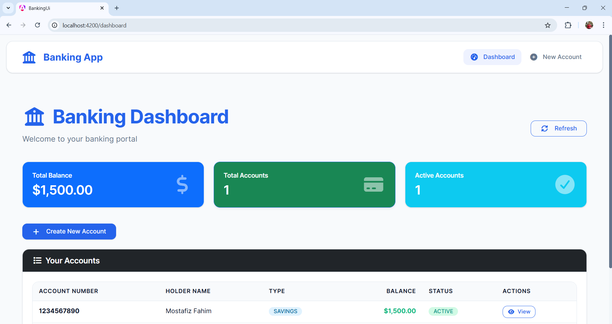
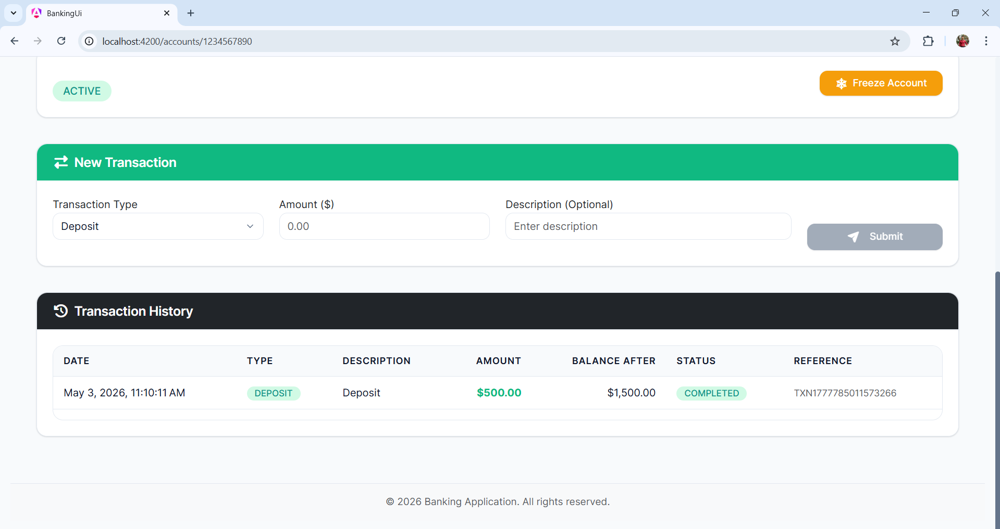
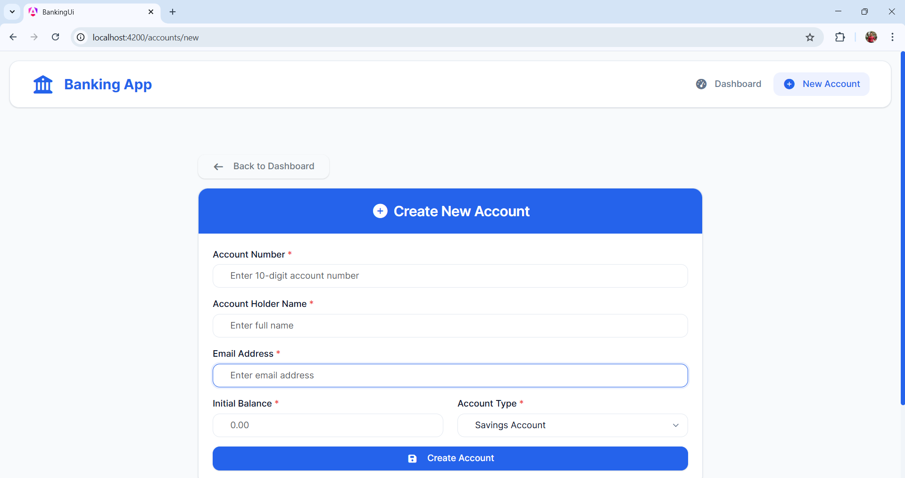
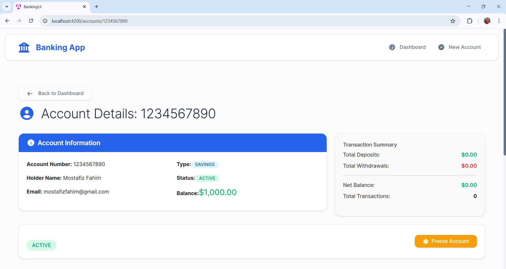
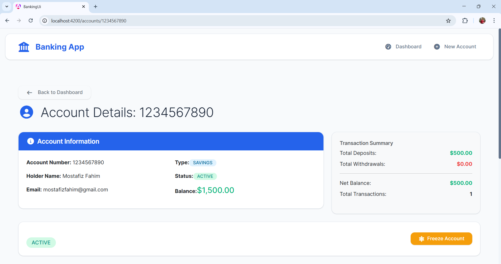
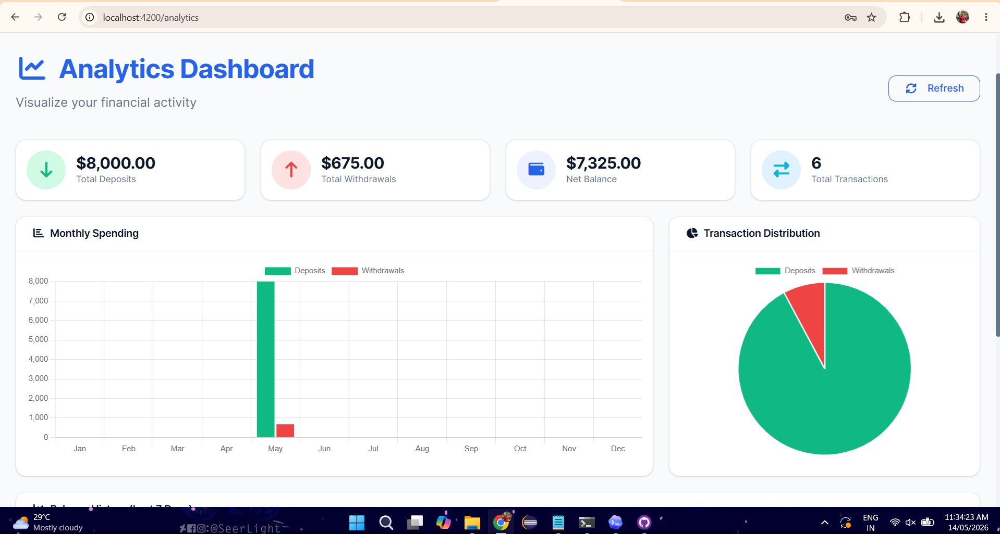

# Banking Microservices Application

A full-stack banking application built with **Spring Boot** and **Angular**. It includes JWT authentication, role-based access control, account management, transaction processing, analytics charts, CSV export, an H2 development database, and a Supabase PostgreSQL production database deployed with Railway and Vercel.

## Live Demo

- Frontend: https://banking-microservices-eta.vercel.app/login
- Backend API: https://banking-api-production-247d.up.railway.app
- Deployment guide: [DEPLOYMENT.md](./DEPLOYMENT.md)

## Project Overview

Users can register, log in, create bank accounts, perform deposits and withdrawals, view transaction history, export transactions, and analyze account activity.

The application supports two roles:

| Role | Access |
| --- | --- |
| `CUSTOMER` | View and manage owned accounts, perform transactions, export own transaction data, view analytics |
| `ADMIN` | View all accounts, manage account status, delete accounts, view transactions, access admin workflows |

The backend uses a layered Spring Boot structure with controllers, DTOs, repositories, entities, security filters, and environment-specific configuration. The frontend uses Angular standalone components, route guards, HTTP interceptors, reusable services, and responsive Bootstrap-based views.

## Screenshots

| View | Preview |
| --- | --- |
| Dashboard |  |
| Account transactions |  |
| Create account |  |
| Account details |  |
| Account after transaction |  |
| Analytics |  |

## Tech Stack

### Backend

- Java 21
- Spring Boot 3.2.4
- Spring Security
- JWT authentication
- BCrypt password hashing
- Spring Data JPA and Hibernate
- H2 for development
- Supabase PostgreSQL for production
- Maven
- JUnit and Mockito
- Docker
- Railway deployment

### Frontend

- Angular 21
- TypeScript
- Angular Router
- Angular route guards
- Angular HTTP interceptor
- Reactive forms
- Bootstrap 5
- Font Awesome
- ngx-toastr
- Chart.js
- Vercel deployment

## Features

### Authentication And Security

- Customer registration
- Admin registration with a configured admin key
- Login with username and password
- JWT token generation and validation
- Role-based authorization
- Protected Angular routes
- Automatic JWT injection in API requests
- Logout and expired-token cleanup
- Password visibility toggle
- Email validation
- CORS configuration for Vercel and local development

### Account Management

- Create accounts
- View owned accounts as a customer
- View all accounts as an admin
- View account by ID or account number
- Delete accounts
- Freeze and activate accounts
- Support multiple accounts per user
- Account types: `SAVINGS`, `CHECKING`
- Account statuses: `ACTIVE`, `FROZEN`, `INACTIVE`

### Transactions And Analytics

- Deposit money
- Withdraw money
- Process transactions through a unified endpoint
- Track transaction history
- View transaction summaries
- Record failed transactions
- Filter by date, type, and amount
- Export transaction history to CSV
- Analytics charts for deposits, withdrawals, and balance history

## Backend API

### Authentication

Base path: `/api/auth`

| Method | Endpoint | Description |
| --- | --- | --- |
| `POST` | `/register` | Register a customer |
| `POST` | `/register-admin` | Register an admin using the configured admin key |
| `POST` | `/login` | Login and return a JWT |
| `GET` | `/test` | Public health-style auth test endpoint |

### Accounts

Base path: `/api/accounts`

| Method | Endpoint | Description |
| --- | --- | --- |
| `GET` | `/` | Get accounts based on role |
| `POST` | `/` | Create a new account |
| `GET` | `/{id}` | Get account by ID |
| `GET` | `/number/{accountNumber}` | Get account by account number |
| `DELETE` | `/{id}` | Delete an account |
| `GET` | `/status/{status}` | Get accounts by status |
| `POST` | `/{accountNumber}/deposit` | Deposit money |
| `POST` | `/{accountNumber}/withdraw` | Withdraw money |
| `POST` | `/transactions` | Process a transaction |
| `PUT` | `/{accountNumber}/status` | Update account status |

### Transactions

Base path: `/api/transactions`

| Method | Endpoint | Description |
| --- | --- | --- |
| `GET` | `/account/{accountNumber}` | Get transaction history |
| `GET` | `/account/{accountNumber}/type/{type}` | Get transactions by type |
| `GET` | `/account/{accountNumber}/summary` | Get transaction summary |
| `GET` | `/reference/{reference}` | Get transaction by reference |

## Project Structure

```text
banking-microservices/
├── backend/
│   ├── Dockerfile
│   ├── railway.json
│   ├── pom.xml
│   └── account-service/
│       ├── pom.xml
│       └── src/
│           ├── main/java/com/banking/account/
│           │   ├── config/
│           │   ├── controller/
│           │   ├── dto/
│           │   ├── entity/
│           │   ├── repository/
│           │   └── security/
│           ├── main/resources/
│           │   ├── application.properties
│           │   ├── application-dev.properties
│           │   └── application-prod.properties
│           └── test/java/com/banking/account/
├── banking-ui/
│   ├── angular.json
│   ├── package.json
│   ├── proxy.conf.json
│   ├── vercel.json
│   └── src/
│       ├── app/
│       │   ├── components/
│       │   ├── guards/
│       │   ├── interceptors/
│       │   ├── models/
│       │   └── services/
│       └── environments/
├── images/
├── DEPLOYMENT.md
└── README.md
```

## Run Locally

### Prerequisites

- Java 21
- Maven 3.9+
- Node.js 18+
- Angular CLI 21
- Docker, optional

### Backend

```powershell
cd backend
mvn clean install
mvn spring-boot:run -pl account-service -Dspring-boot.run.profiles=dev
```

Backend URL:

```text
http://localhost:8081
```

H2 console:

```text
http://localhost:8081/h2-console
```

H2 defaults:

```text
JDBC URL: jdbc:h2:mem:bankingdb
Username: sa
Password:
```

### Frontend

```powershell
cd banking-ui
npm install
ng serve
```

Frontend URL:

```text
http://localhost:4200
```

Local API configuration is in `banking-ui/src/environments/environment.ts`:

```ts
export const environment = {
  production: false,
  apiUrl: 'http://localhost:8081/api',
  wsUrl: ''
};
```

Production API configuration is in `banking-ui/src/environments/environment.prod.ts`:

```ts
export const environment = {
  production: true,
  apiUrl: 'https://banking-api-production-247d.up.railway.app/api',
  wsUrl: ''
};
```

## Deployment

Production uses:

- Railway for the Spring Boot backend
- Supabase for PostgreSQL
- Vercel for the Angular frontend

Railway should deploy from the `/backend` directory and use `/backend/railway.json`. See [DEPLOYMENT.md](./DEPLOYMENT.md) for the exact Railway variables and Supabase pooler configuration.

## Admin Setup

Create the first admin through the backend API so the password is hashed correctly.

Development example:

```powershell
curl -X POST http://localhost:8081/api/auth/register-admin `
  -H "Content-Type: application/json" `
  -d "{\"username\":\"admin\",\"password\":\"admin123\",\"email\":\"admin@bank.com\",\"adminKey\":\"SUPER_SECRET_KEY_123\"}"
```

Production example:

```powershell
Invoke-RestMethod `
  -Uri "https://banking-api-production-247d.up.railway.app/api/auth/register-admin" `
  -Method POST `
  -ContentType "application/json" `
  -Body '{"username":"admin","password":"use-a-strong-password","email":"admin@example.com","adminKey":"<ADMIN_SECRET_KEY>"}'
```

Do not insert admins manually into the database. Do not commit production secrets.

## Testing

Run backend tests:

```powershell
cd backend
mvn -pl account-service test
```

Run frontend build:

```powershell
cd banking-ui
npm run build
```

Current test coverage includes:

- Account controller tests
- Transaction controller tests
- Account repository tests

## Docker

Build and run the backend image:

```powershell
cd backend
docker build -t banking-account-service .
docker run -p 8081:8081 banking-account-service
```

## Useful Commands

Kill a process running on port `8081` with PowerShell:

```powershell
Get-Process -Id (Get-NetTCPConnection -LocalPort 8081).OwningProcess | Stop-Process -Force
```

Kill a process running on port `8081` with CMD:

```cmd
netstat -ano | findstr :8081
taskkill /PID YOUR_PID /F
```

## Project Metrics

| Metric | Value |
| --- | --- |
| Backend endpoints | 15+ |
| Frontend components | 7+ |
| Database tables | 3 |
| User roles | 2 |
| Charts | 3 |
| Deployment platforms | Railway + Supabase + Vercel |
| Databases | H2 + Supabase PostgreSQL |

## Security Notes

- Passwords are hashed with BCrypt.
- JWT is used for stateless authentication.
- Protected endpoints require a valid JWT.
- Role-based access is enforced for `CUSTOMER` and `ADMIN`.
- Admin registration requires `ADMIN_SECRET_KEY`.
- Store production credentials in Railway environment variables only.
- Rotate any secret that has been shared outside the hosting provider.

## Future Improvements

- Add Swagger/OpenAPI documentation
- Add service-layer unit tests
- Add pagination and sorting for accounts and transactions
- Add advanced roles and permissions
- Add email notifications for transactions
- Add two-factor authentication
- Add real-time notifications
- Add GitHub Actions CI/CD
- Add PDF export for transaction reports
- Add Docker Compose for local backend and database
- Split into separate services such as user, notification, loan, and account services

## License

This project is for educational and portfolio purposes.
